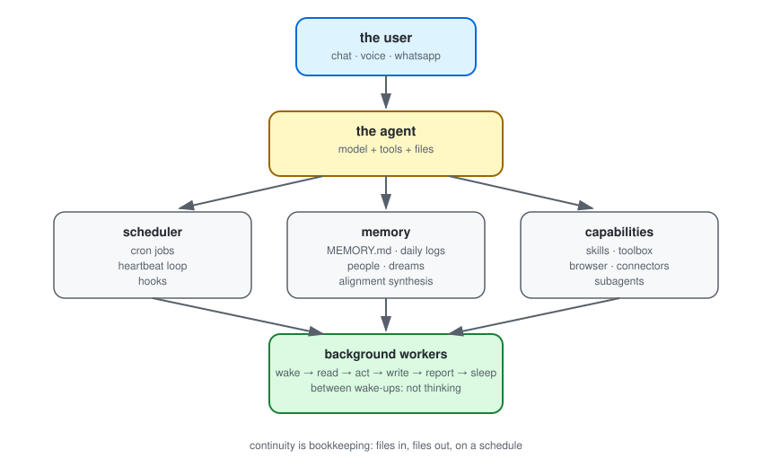

# Muse runtime

How a Muse instance actually works: the filesystem, the scheduler, the memory pipeline and the agent machinery, mapped from a live runtime.

This repository documents the runtime architecture of a Muse personal AI assistant instance: the directory layout it operates from, the scheduler that wakes it, the memory pipeline it uses for continuity, the skill and tool systems and the browser and agent infrastructure. All content is drawn from observations of a live instance and sanitized of personal data. Where behavior is inferred rather than directly observed, the docs say so.

## Overview



The instance combines a language model with a persistent Linux home directory, a tool system (shell, browser, skills, connectors) and a scheduler. It activates on an event (a message, a timer, a completed background task), reads its files for context, acts through its tools, records what happened and goes idle. It does not process anything between activations; continuity is maintained through files written and read across sessions.

## Contents

If you're just curious, start at the top:

- [The big picture](docs/00-big-picture.md) - how the pieces fit
- [Filesystem](docs/01-filesystem.md) - the files the instance lives in
- [Memory](docs/03-memory.md) - how it remembers things

The rest goes deeper:

- [Scheduler](docs/02-scheduler.md) - cron jobs, the 30-minute background loop, staleness guards, dedupe
- [Skills](docs/04-skills.md) - the playbook system: what a skill is, how they're found and written
- [Browser](docs/05-browser.md) - the managed browser and how login sessions survive across tasks
- [Agents](docs/08-agents.md) - subagents, task agents, workers and handoffs
- [Toolbox](docs/09-toolbox.md) - the full tool set: shell, browser, scheduler, vault, wallet and the rest
- [Autonomy](docs/06-autonomy.md) - the rules that keep self-directed behavior honest
- [Safety](docs/07-safety.md) - credential storage, approvals, prompt-injection defense
- [Glossary](docs/glossary.md) - the vocabulary

## The live snapshot

The [`snapshot/`](snapshot/) directory is the closest thing to seeing the backend: a sanitized map of the instance's home directory, a generic version of the background checklist, sample job definitions and a `runtime-info.json` with the snapshot date. It gets regenerated from the live instance on a schedule, so check the date for freshness.

```bash
git clone https://github.com/mikezio/muse-runtime.git
```

## Scope

Unofficial. Not Meta documentation, not a spec. One instance's view from the inside, and where something is inferred rather than observed it says so. Details change over time; the patterns change slower than the details. If you run an instance and something here contradicts what you see, open an issue.
