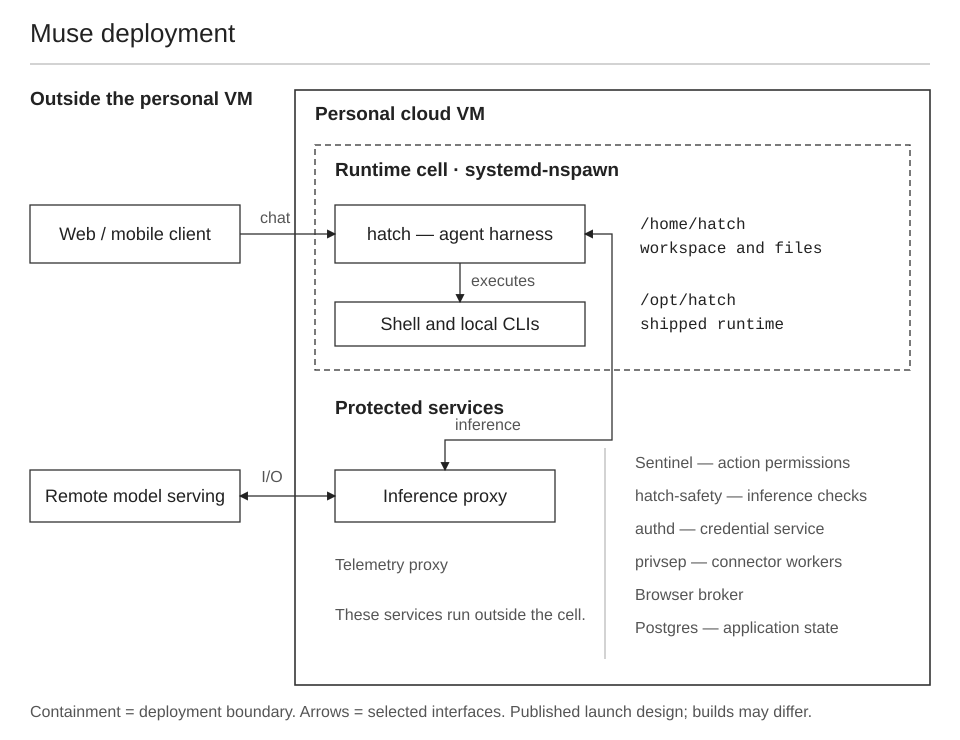

# Muse runtime: a field guide

An unofficial guide to how Muse's agent system fits together, with diagrams, practical references, and sanitized per-build runtime archives.

**Start here: [How Muse fits together](docs/00-big-picture.md)**



## What you can learn here

| I want to… | Start with |
|---|---|
| Understand the whole system | [Architecture and request flow](docs/00-big-picture.md) |
| Follow a task from request to result | [Worked examples](docs/walkthroughs.md) |
| Diagnose a failure | [Troubleshooting by layer](docs/troubleshooting.md) |
| Understand cell root, the host and Sentinel | [Execution boundaries](docs/01-the-machine.md) |
| Identify daemons, services, tools and state | [Component reference](docs/components.md) |
| Explore what Muse can do | [Capability atlas](docs/capabilities.md) |
| Understand settings, model routes and reasoning | [Configuration](docs/configuration.md), [model routes](docs/model-routes.md) |
| Inspect daemon APIs and database surfaces | [Runtime API guide](docs/runtime-api.md) |
| Understand feature flags and rollout | [Feature flags](docs/feature-flags.md) |
| Understand memory, agents and browsing | [Memory](docs/12-memory.md), [agents](docs/15-agents.md), [browser](docs/06-browser.md) |
| Compare runtime updates | [Archive workflow](docs/archive-workflow.md), [build index](builds.md) |

The [full documentation index](docs/README.md) includes the security, privacy, scheduling, skills and model-background chapters.

## The central distinction

The model performs inference remotely. The runtime manages context, tools, tasks and state. The isolated Linux cell is an execution environment where software and files can be used; it does not confer host administrator access. Browser services, connectors, devices and credentials have their own interfaces and permissions.

The broader agent spans these components. An archive of the cell's files is useful evidence, but it is not the whole hosted platform or a runnable copy of Muse.

## Diagrams

- [System architecture](assets/architecture.svg) — responsibilities and connections.
- [Request lifecycle](assets/request-lifecycle.svg) — message, context, inference, tools and delivery.
- [Trust boundaries](assets/trust-boundaries.svg) — cell privileges, mediated access and remaining consequences.
- [Configuration layers](assets/configuration-layers.svg) — files, reasoning, routing, client flags and platform policy.
- [Agent roles](assets/agent-tree.svg) — ownership, delegation and independent model policies.
- [Browser lifecycle](assets/browser-lineage.svg) — task ownership, session state and continuations.
- [Memory system](assets/memory-pipeline.svg) — files, structured records, retrieval and provenance.
- [Background work](assets/scheduler-loop.svg) — triggers, dispatch, execution and verified delivery.

## Archives you can investigate

[GitHub Releases](https://github.com/mikezio/muse-runtime/releases) contain filtered filesystem snapshots and per-file SHA-256 manifests. [builds.md](builds.md) tracks observed builds. Personal files are intended to be excluded; every contribution still needs content review.

You can compare two manifests without downloading or executing the runtime:

```bash
python3 tools/compare-manifests.py before.manifest.txt after.manifest.txt --prefix opt/skills
```

The [archive guide](docs/archive-workflow.md) explains downloading assets, split parts, checksum types, and how to turn changed files into useful findings.

## How to read the claims

A shipped skill, compiled model name, accepted setting and successful live operation are different kinds of evidence. Operational pages state their observation dates and limits. Most exploratory results date to September 26–27, 2026; selected component paths were rechecked on September 28 against build `1eefe22acda`.

This is not official Meta documentation or a security audit. Not every account has the same features. See [evidence and open questions](docs/evidence.md) and [source publications](docs/sources.md).

## Contribute

See [CONTRIBUTING.md](CONTRIBUTING.md) for snapshots and research contributions. Useful additions explain what changed, how it was checked and what remains unknown.
