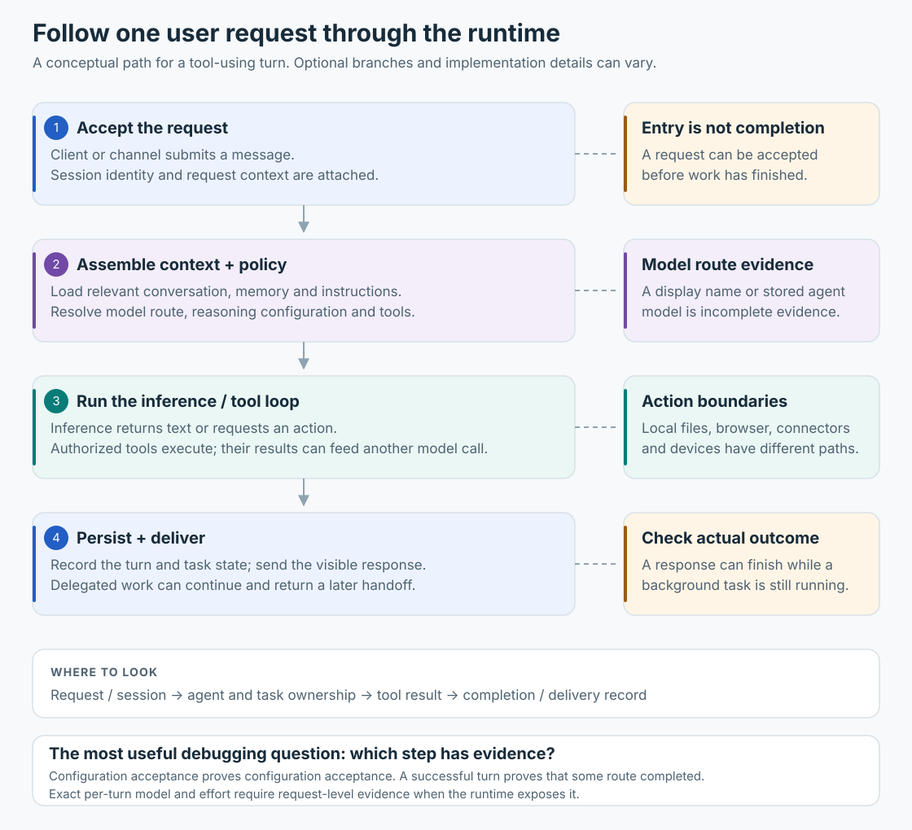

# Remote inference and local execution

The model inference serving Muse runs remotely from the user's execution cell. The model weights were not present in the inspected cell. The agent system combines inference with runtime-managed context, tools and state. The Hatch harness itself runs inside the cell in the published architecture; “inference is remote” does not mean the whole runtime runs outside it.

## Inference is one step in a larger loop

An inference request supplies context and receives assistant output. A tool call in that output is a structured request: a name and arguments. The runtime routes it to an execution surface and supplies the result to subsequent work.

| Requested work | Execution surface | Typical result |
|---|---|---|
| Run a command | Shell/execution service in the cell | Output, exit status, or process handle |
| Read a local file | File tool or cell process | Bounded file contents |
| Browse an interactive site | Browser task and managed browser broker | Task receipt followed by a result/handoff |
| Read a connected account | Connector/skill interface | Structured data or permission error |
| Use a paired computer | Device command service | Device result, offline state, or approval request |
| Delegate analysis | Child-agent lifecycle | Child result delivered to the owner |

These are logical paths. Not every tool executes inside the cell, and not every task is synchronous.

## Why installing software does not change the model

Installing a package changes the tools available to programs in the cell. Editing a prompt or standing note can change the input sent to inference. Selecting a model route asks the runtime to change its model policy. None of those operations edits model weights.

Likewise, the model can request a connector operation without receiving the connector's underlying credential. Authorized interfaces supply the operation; cell root does not replace their access checks.

## Idle and background work

A runtime can keep services, queues, schedules, browser sessions and stored agent state alive while no model request is in flight. A new message, scheduled event, or task completion can trigger more inference. A paused conversation therefore does not imply that the daemon or every background process has stopped.

Subagents are separately managed contexts/tasks. Their tools and routing can differ from the root's. Browser tasks have an explicit brief and ownership lineage; they should not be treated as generic children with identical context and permissions.

## What inspection can establish

Launch scripts and SDKs describe interfaces. A successful tool result establishes that a specific operation worked at that time. A selected model field establishes a runtime selection. Per-request provider metadata would be needed to establish the exact upstream model and reasoning setting used for a particular inference request.

That last metadata was not available in the inspected root/subagent status surfaces. See [model routes](model-routes.md) and [evidence](evidence.md).
