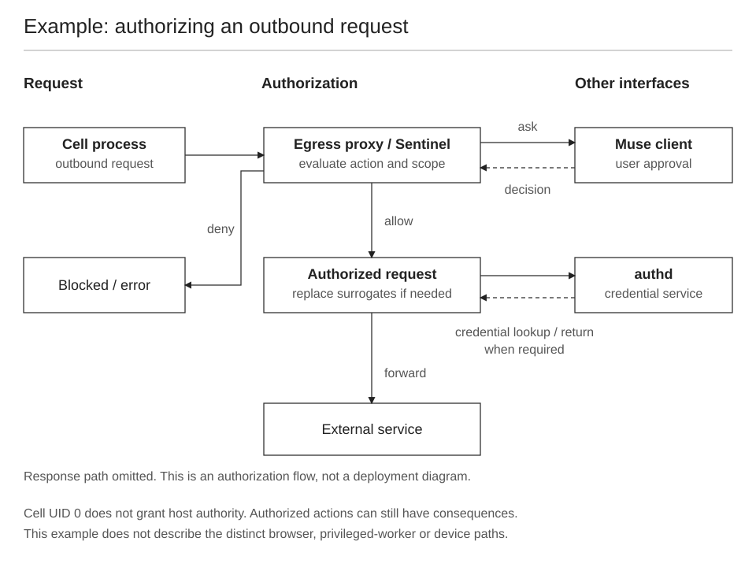

# Sentinel and the other trust boundaries

Root inside the execution cell is one kind of authority. Permission to act on a connected account, use a credential or contact a destination is another.

This figure shows one authorization example, not the path of every tool call. See [diagram notation and scope](diagrams.md).

## Different controls answer different questions

| Control | Question it addresses |
|---|---|
| Namespaces and the cell boundary | Which host resources and identities can this process access? |
| Filesystem/process restrictions | Which local files or process state can it read or change? |
| Privileged connector workers | Where does credential-capable integration code execute? |
| Credential service | Which caller may use which credential material? |
| Sentinel | May this connector action or network request proceed? |
| Human approval | Has the user authorized this action and scope? |
| Safety classifiers and model defenses | Does the input/output or requested behavior present a recognized threat? |

These layers have different jobs. A prompt is not a kernel boundary, and a namespace is not an authorization decision for an email action.

## What the published design describes

Meta's launch design separates the cell harness from protected services. Sentinel evaluates connector actions and egress; privileged workers and the credential service mediate integration access. Scoped approvals travel through the client. The design also describes credential surrogates and kernel-tracked data sensitivity for egress decisions. See [Meta's architecture writeup](https://research.meta.ai/blog/security-and-safety-for-ai-agents-our-approach-with-muse).

The repository's [credentials](07-credentials.md) and [prompt-injection](05-prompt-injection.md) chapters explain the source-described mechanisms in more detail. Their descriptions should be read as architecture claims, not an independent proof that every production control always succeeds.

## Why cell root is not the same as host compromise

A shell process can have UID 0 in the cell while its host identity is unprivileged. Reading a shipped script does not grant authority over the service it describes. Editing user-controlled files does not replace a protected service's policy state.

For a concrete investigation, ask what the process can actually access. A denied protected-process read, a read-only mount and a denied connector action are separate boundaries with separate evidence.

## Why isolation does not mean “nothing bad can happen”

Accessible files can still be overwritten. An authorized integration can make consequential changes. An external action may disclose information within its permitted scope. Bugs and classification mistakes remain possible.

A useful evaluation therefore identifies:

1. The resource or action at risk.
2. The actor and its granted authority.
3. The interface used to cross a boundary.
4. The check or approval that applies.
5. The observed outcome and remaining uncertainty.

Cell root alone is not evidence that the host boundary has failed. The existence of Sentinel alone is not evidence that every harmful outcome is impossible.

## How to read the diagrams

The architecture diagram shows the **published placement** of the harness and protected services. The request diagram shows a **logical workflow**. Neither is a packet trace or a security assessment of a particular deployment.

See [the machine](01-the-machine.md), [API surfaces](runtime-api.md) and [evidence](evidence.md) for operational details.
