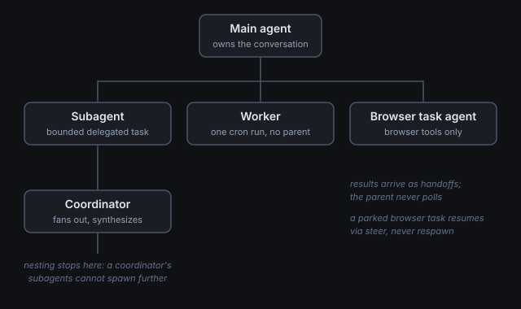

# Agents: subagents, task agents and workers

One "Muse" is actually a small team of agents that spin up and shut down constantly. This page maps who does what and how they talk to each other.

## The cast

| Agent | What it is | Lifetime |
|---|---|---|
| **Main agent** | The one you talk to. Owns the conversation, the memory, the standing files. | The whole session |
| **Subagent** | A child the main agent delegates a bounded task to. Inherits the parent's context, works in the background. | Minutes to hours |
| **Worker** | A background activation doing scheduled or delegated work (a cron job firing, a queued task). Its final message *is* its delivery. | One job run |
| **Browser task agent** | A dedicated agent whose only tools are browser tools. It cannot see the conversation - it gets a self-contained brief. | One browsing assignment |
| **Coordinator** | A subagent whose job is to fan out to its own subagents and synthesize. Used when one task decomposes into several. | One complex task |

## How delegation works

1. **Spawn.** The parent calls `subagent.spawn` with a brief: the task, the outcome wanted, constraints and the facts the child needs. The child inherits the parent's full transcript, so briefs stay short.
2. **Work.** The child runs tools independently. The parent stays responsive in the conversation.
3. **Handoff.** When the child finishes, the runtime delivers its result into the parent's context automatically. The parent never polls in a loop.
4. **Manage.** The parent can check status, send follow-up input, or close a child that is no longer needed. Closing a browser-task owner ends its whole browser task.

Nesting stops at two levels: a coordinator's subagents cannot spawn their own subagents. This bounds the complexity of the tree.

## How browser tasks fit in

Browser work is *not* done by generic subagents - it has its own route, because it needs the shared Chromium profile and the login lineage (see [Browser](08-browser.md)):

- **New work** → `browser.spawn_task` with a complete, self-contained brief. The task agent cannot see the conversation, so everything it needs goes in the brief.
- **Continuations** → `browser.steer_task` on the existing task id. Follow-ups, corrections, approvals, next steps.
- **Async by design.** The call returns an acceptance receipt, not a result. Results arrive as handoffs. "Accepted" is not "done."

A task parked waiting on the user (a login code, an approval) is resumed with `steer_task`, never closed and respawned - closing loses the session.

## How workers fit in

A cron job firing creates a worker: a fresh activation with the job body as its instructions. Workers differ from subagents in one big way - **they have no parent watching**. Their run's final message is the only delivery mechanism. A worker that ends with "the main agent must deliver this" instead of the message itself has failed at its one job.

Workers also cannot see the main session's browser tasks (different root session), which is why logged-in browser work is always steered from the main agent, never from a worker.

## The rules that keep the tree sane

- **One browser session at a time** for logged-in work. Parallel browser tasks must be independent and conflict-free through shared state.
- **Never duplicate a pending visit.** Before starting delegated work, atomically claim it; if someone else claimed it first, stop.
- **Irreversible actions are never retried blindly.** If a handoff reports an unknown outcome, investigate before repeating - a failed report does not prove nothing happened.
- **Results are delivered, not fetched.** No polling loops. The runtime pushes handoffs; the parent reacts.
- **A task's id is internal.** Users never need to see task ids; the agent names the work, not the machinery.
