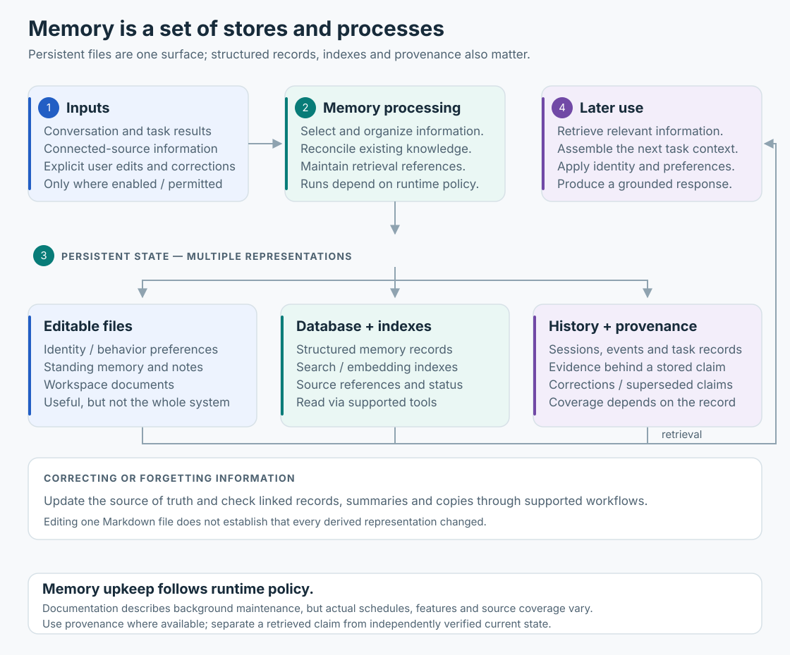

# Memory: files, records, retrieval and provenance

Editable Markdown is one visible memory surface. The runtime also exposes structured records, search/index concepts, provenance and derived state. “Everything the agent remembers is a file” is an incomplete model.

## Different kinds of continuity

| State | Purpose | Example |
|---|---|---|
| Standing files | User/agent-editable guidance and durable notes | `MEMORY.md`, `SOUL.md`, `IDENTITY.md` |
| Conversation/task history | What was said and what work happened | Session records, agent/task relationships |
| Structured memory | Claims, source references and updates | Provenance and superseded information |
| Retrieval/index state | Find relevant prior information | Search interfaces and embedding registry |
| Derived outputs | Turn stored information into useful summaries/preferences | Documented consolidation and personalization workflows |

An inspected embedding registry described a 384-dimensional cosine embedding configuration. That establishes a registered representation, not the exact retrieval algorithm used for every memory query.

## Capture and retrieval

Installed operating guidance instructs the agent to record durable facts and consult memory when answering questions about prior work or preferences. That is a workflow instruction, not proof that every turn performed a write or search.

A retrieved memory is evidence of a stored claim. It can be stale, incomplete or contradicted by current information. Source references and timestamps help determine how much to trust it.

## Provenance

The `memory_explain` capability describes where a claim came from and how it relates to previous or superseded information. This is useful for questions such as “why does Muse think that?” without dumping unrelated personal history.

Keep these questions separate:

1. What is currently stored?
2. What source supports it?
3. Was that source accurate?
4. Does the claim remain true now?

## Consolidation and personalization

Installed guidance describes background memory upkeep, consolidation, dreaming/derived notes, learning and proactive feed/idea workflows. Actual schedules, source coverage and feature gates can vary. A universal nightly job or fixed cadence should not be inferred from a skill description.

Identity/persona files can also influence presentation and voice workflows. They are editable preferences, not changes to model weights.

## Correcting or forgetting

Updating one file does not prove every indexed record, summary, automation or copy changed. The installed forget workflow identifies affected information and automations, prepares a plan, and requires confirmation before changes.

After a correction or deletion, verify the relevant retrieval and workflow surfaces. Removal from future retrieval is not evidence of deletion from all backups or downstream services.

See [data/privacy](09-data-and-privacy.md) for the source-based policy discussion and [API surfaces](runtime-api.md) for the distinction between native memory/database tools and shell access.
