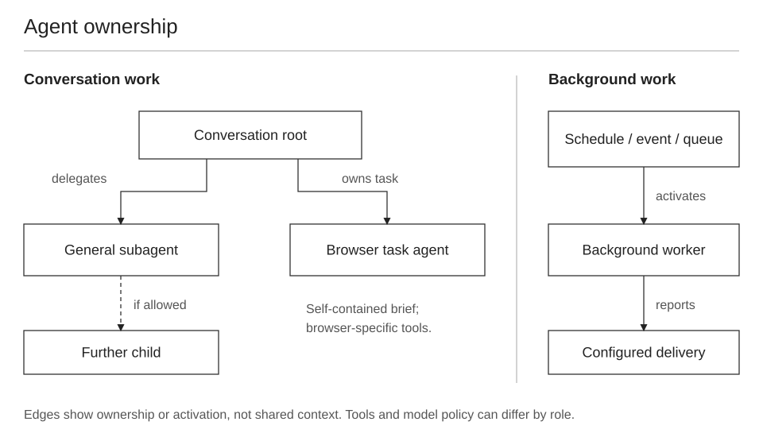

# Agents, browser tasks and background workers

A single conversation can coordinate several managed tasks and contexts. Roles describe ownership and purpose; they do not guarantee identical models, tools or permissions.

## The roles

| Role | Responsibility | Context/tool distinction |
|---|---|---|
| Root/conversation agent | Owns the user-facing turn and coordinates work | Has the conversation and its available runtime tools |
| General subagent | Performs a bounded delegated task | Context transfer and tools depend on the spawn interface/policy |
| Browser task agent | Performs a browsing assignment | Receives a self-contained brief; uses the browser task surface |
| Background worker | Executes scheduled, queued or event-driven work | Own request/owner and delivery path; not necessarily a child of the active chat |
| Coordinator | Delegates a larger task and combines results | A role within an allowed delegation tree |

An inspected child header reported depth 1 of 2 and permission to spawn. That is evidence for the observed configuration, not a universal nesting limit.

## Follow ownership, not just the display name

For a task, identify its owner, agent ID, request/task ID, state and result. A successful spawn means accepted work. Completion requires a finished outcome, and delivery requires that the intended recipient received it.

General delegation tools support spawning and follow-up/status management. Browser work has its own `browser.spawn_task` / `browser.steer_task` lifecycle. Continue the existing task when it is waiting for user input; creating another task can lose continuity or duplicate work.

Context inheritance should be checked against the actual tool contract. Do not assume every child receives the whole transcript or every worker sees the active chat's browser tasks.

## Models and tools can differ

In the observed tests, a root agent record and its child record could contain different model routes. Native `muse.session_status` was available to the root but unavailable to the tested subagent.

A child that lacks a metadata tool cannot confirm that the underlying metadata fields are absent. Likewise, an agent row's stored model does not establish the provider used for every turn. See [model routing](model-routes.md).

**Model selection was global in the tested runtime/account and cleared working context in existing chats.** A side chat did not isolate that effect.

## Operational checks

- Give delegated work an outcome and enough context to act.
- Separate independent work from operations that share mutable browser/app state.
- Distinguish accepted, running, waiting, completed and failed states.
- After an interruption, inspect the outcome before repeating a consequential action.
- Follow the runtime's handoff/delivery contract; do not assume a finished background task has already reached the user.

Related: [request flow](02-the-agent-outside.md), [browser lifecycle](06-browser.md), [background work](11-scheduler.md).
