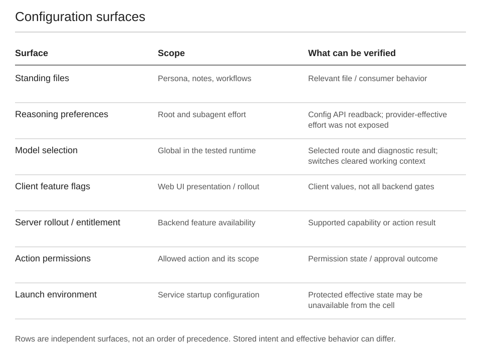

# Configuration: which layer are you changing?

There is no single file that controls every aspect of Muse.



## Configuration map

| Surface | Observed use | Verification |
|---|---|---|
| Standing Markdown and workspace files | Persona, preferences, custom workflows | Identify the consumer and observe relevant behavior |
| `config/home.yaml` / `config.get`, `config.update` | Root/subagent reasoning preferences | Accepted update and runtime readback |
| `model.get`, `model.set` | Global model selection and canonical aliases | Readback, context-change notice, diagnostic completion |
| Client feature configuration | Which web features are surfaced | Current client bootstrap values |
| Server gates/experiments | Backend capabilities and policy | Supported capability/operation result |
| Host launch environment | Provider options and service startup configuration | Operator-level effective state; guest copy is insufficient |

Observations below date to September 26–27, 2026. They are not promises of a stable public API.

## Reasoning effort

The inspected configuration API supported `llm.reasoning`. Other `llm` keys were retired or ignored in the observed configuration path; model selection had its own API.

Illustrative configuration:

```yaml
llm:
  reasoning:
    root_agent:
      effort: max
    subagent:
      effort: max
```

Accepted effort vocabulary was `minimal`, `low`, `medium`, `high`, `xhigh`, `max`. The runtime also accepted spelling aliases for extra-high. `none` and `ultra` were rejected.

This is a runtime vocabulary. A provider may map or constrain it. A successful turn after saving `max` does not expose how much reasoning the upstream model performed. See [model routes](model-routes.md).

## Verify that a setting is being used

Use a chain of evidence:

1. **Stored:** the intended value is in the file or preference store.
2. **Accepted:** the supported configuration API accepts it.
3. **Read back:** the runtime's configuration surface returns it.
4. **Exercised:** a relevant operation completes after the change.
5. **Request-confirmed:** per-request metadata exposes the effective value.

The first four can be useful without the fifth. Report the strongest step actually observed. Watching a file open establishes access, not necessarily use of a particular field.

In our tests, native root status showed model branding but no effort/tier fields. The subagent did not have the same status tool. Browser-task requester model fields were null. These absences left provider interpretation unresolved.

## A model change is broader than a side chat

**The observed model selector affected existing chats and cleared working context.** The UI showed a model-change/context-cleared notice. Transcript availability and working inference context are separate.

A diagnostic side chat helped keep test messages organized; it did not isolate this global setting. Record the previous model and effort settings before an intentional test and restore/read them back afterward. Do not switch through a model catalog casually to identify one field.

## Launch environment is a separate surface

Compiled names included:

```text
JARVIS_IPNEXT_TEMPERATURE
JARVIS_IPNEXT_TOP_P
JARVIS_IPNEXT_TOP_K
JARVIS_IPNEXT_MIN_P
JARVIS_IPNEXT_SEED
JARVIS_IPNEXT_PRESENCE_PENALTY
JARVIS_IPNEXT_FREQUENCY_PENALTY
JARVIS_IPNEXT_REPETITION_PENALTY
JARVIS_IPNEXT_REASONING_EFFORT
JARVIS_AVOCADO_CONTEXT_WINDOW_TOKENS
JARVIS_AVOCADO_COMPACTION_TRIGGER_TOKENS
JARVIS_MODEL_ID_OVERRIDE
JARVIS_ENV_FILE
```

These strings indicate compiled configuration concepts, not verified user-settable controls. We did not establish defaults, validation ranges or effective values for all of them.

Earlier launcher inspection found an operator environment override applied at startup. The guest's `/etc/hatch/env.override` was a scrubbed, read-only copy recreated during bootstrap. No supported user-owned replacement or hot reload was found. Editing `home.yaml` does not automatically set these environment variables.

## Useful diagnostic questions

- Which component reads this setting?
- Is it per conversation, global to the account/runtime, per agent role, or per client?
- Is the file authoritative or a generated copy?
- Does the change require a new request, a new agent, or a process restart?
- Can the runtime show effective state, or only stored intent?
- Does restoration also restore the previous context? In the model-switch tests, it did not.

Related: [feature flags](feature-flags.md), [API surface](runtime-api.md), [evidence](evidence.md).
